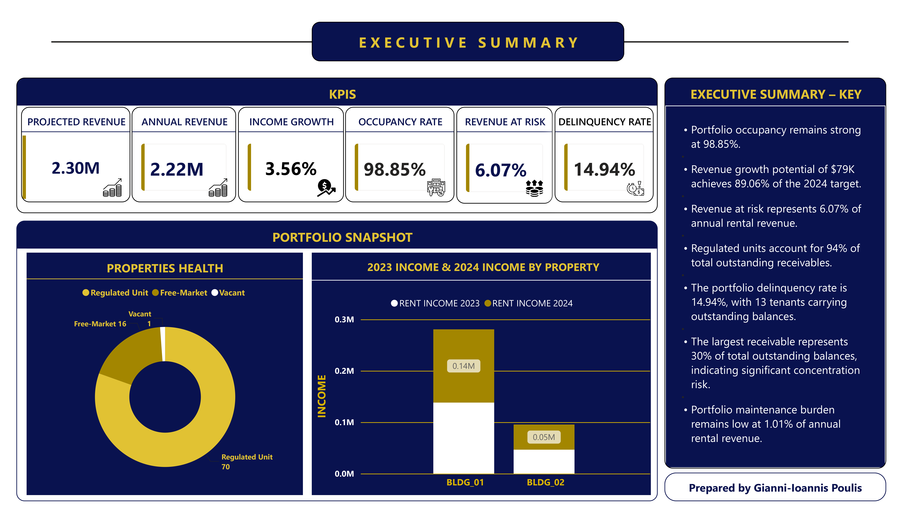
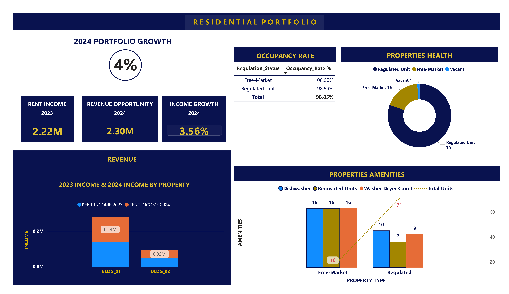
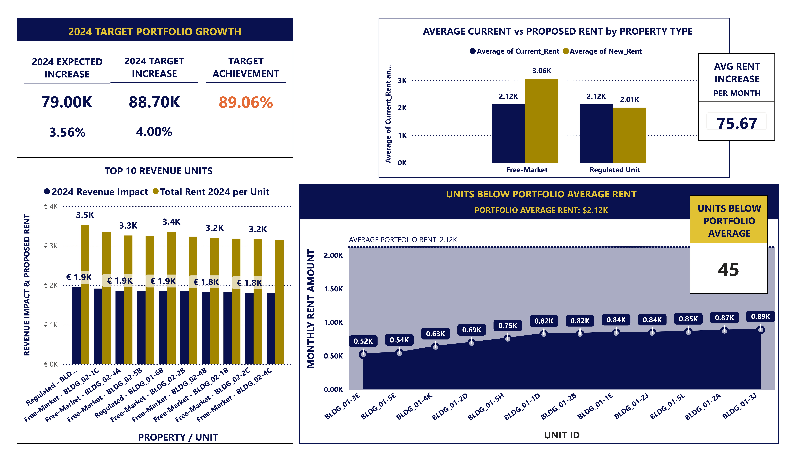
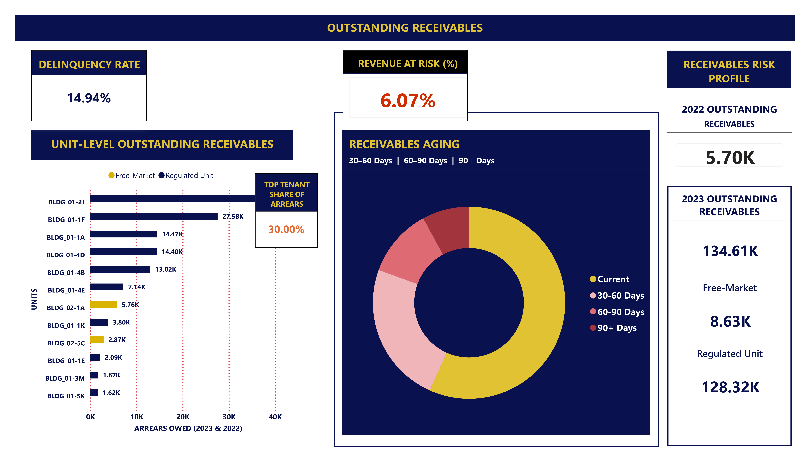
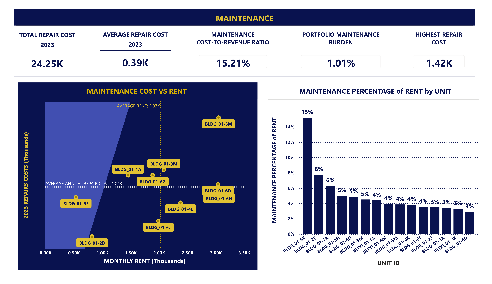
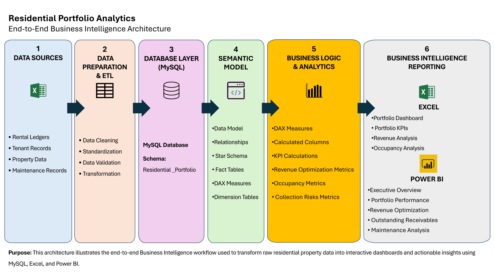
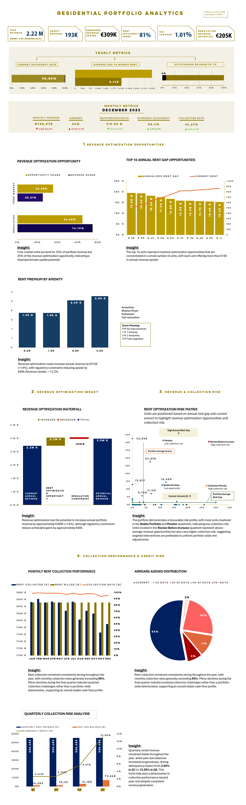

# Residential Portfolio Analytics
## Revenue Optimization and Portfolio Performance Dashboard

This end-to-end Business Intelligence project transforms residential property data into actionable business insights through relational database design, SQL analytics, feature engineering, and interactive dashboard development.

**Tools:** Excel • MySQL • Power BI • DAX • Power Query

## Project Overview
This project transforms residential property data into actionable business insights through database design, SQL analysis, feature engineering, and dashboard development. It was built to support revenue optimization, receivables monitoring, and operational decision-making.

## Dashboard Preview
The Power BI dashboard provides an executive view of occupancy, revenue, receivables, maintenance, and optimization opportunities.


## Project at a Glance

| Metric | Value |
|---|---:|
| Residential Buildings | 2 |
| Apartments | 87 |
| Core SQL Tables | 6 |
| Analytical Views | 13 |
| Business Analysis Queries | 7 |
| Power BI Report Pages | 5 |
| DAX Measures | 28 |
| Data Sources | Excel, MySQL |
| Technologies | Excel, MySQL, Power BI |

## Power BI Report Pages

- **Page 1: Executive Summary** - High-level portfolio KPIs and overall performance.


 
- **Page 2: Revenue Analysis** - Revenue trends, rent levels, and optimization opportunities.



- **Page 3: Rent Optimization** - Units with below-market rent and recommended increases.



- **Page 4: Receivables Analysis** - Outstanding balances, aging, and delinquency risk.



- **Page 5: Maintenance Analysis** - Repair costs, maintenance burden, and operational impact.



## Business Problem
Residential property portfolios often contain hidden revenue opportunities caused by below-market rents, long-tenure leases, and operational inefficiencies. Property managers also need to track tenant arrears, maintenance costs, and portfolio performance to support faster operational and investment decisions.

## Why This Matters
This project helps property managers identify where revenue is being left on the table, where collection risk is concentrated, and where maintenance costs may affect overall portfolio performance. It converts fragmented operational data into a structured analytical model that supports better decisions.

## Business Questions
This project was designed to answer three core business themes:

### Revenue Optimization
- How much revenue is currently generated by the portfolio?
- Where is the greatest revenue optimization opportunity?
- Which units offer the highest upside through rent increases or renovation?
- How efficiently is the portfolio capturing rent relative to legal benchmark levels?

### Collection Risk
- Which tenants represent the highest collection risk?
- Where is receivables exposure most concentrated?

### Maintenance Performance
- What financial impact do maintenance costs have on portfolio performance?
- Which maintenance patterns create the greatest cost pressure?

## Workflow


## Dashboard Development
Designed and developed two executive dashboards focused on portfolio performance and revenue optimization. The dashboards include KPI cards, trend analysis, optimization visuals, receivables aging segmentation, and risk analysis.

Key visuals include:
- Portfolio KPI cards.
- Annual and monthly performance trends.
- Rent premium analysis by amenities.
- Waterfall analysis of revenue optimization.
- Rent optimization matrix comparing rent gap and arrears risk.
- Receivables aging and delinquency segmentation.
- Quarterly risk analysis.
- Regression analysis for performance trends.

## Excel Executive Dashboard


## Business Impact
The analytical solution generated several actionable insights:

### Portfolio Performance
- Achieved an occupancy rate of 98.85%.

### Revenue Optimization
- Identified over €309K in embedded annual revenue upside.
- Quantified €407K in theoretical annual revenue opportunity from legal rent gaps.
- Identified €79K in unrealized annual rental revenue opportunities.
- Prioritized long-tenure units representing approximately €207K in additional revenue potential.

### Credit Risk
- Measured revenue at risk at 6.07% of annual rental revenue.
- Revealed that 94% of outstanding receivables originate from regulated units.
- Identified a concentration risk, with one tenant accounting for 30% of total outstanding receivables.

### Operational Performance
- Confirmed a low maintenance burden of 1.01% of annual rental revenue.

## Business Recommendations
- Review 13 low-rent units below €1,000 for potential rent adjustments.
- Prioritize long-tenure units above 10 years for phased rent optimization.
- Strengthen collection strategies for high-risk tenants.

These findings provide clear, data-driven direction to improve revenue performance, prioritize collection efforts, optimize maintenance planning, and support investment decisions.

## Challenges Solved
- Inconsistent naming across datasets.
- Missing values in source records.
- Different reporting years across data sources.
- Unit standardization and data harmonization.

## Skills Demonstrated

| Skill | Evidence |
|---|---|
| Project Management | Designed and executed an end-to-end analytics workflow spanning data preparation, analysis, dashboard development, and business communication. |
| Data Collection | Consolidated rental and portfolio data into a structured analytical dataset for reporting. |
| Data Preparation & ETL | Cleaned, transformed, standardized, and validated data using Power Query. |
| Database Design | Designed and implemented a relational MySQL database with analytical SQL views for reporting. |
| SQL Development | Built analytical SQL solutions using joins, CTEs, subqueries, CASE expressions, window functions, aggregate functions, and NULL handling. |
| Feature Engineering | Created analytical metrics for rent performance, occupancy, payment tracking, and property comparisons. |
| Business Intelligence | Transformed operational data into actionable insights through reporting and visualization. |
| Data Analysis | Analyzed rental performance across 2 residential buildings and 87 apartments. |
| Dashboard Development | Built executive dashboards with KPI tracking, trends, and portfolio insights. |
| Power BI Development | Created 28 DAX measures, interactive slicers, filters, and report navigation. |
| Excel Development | Built advanced Excel dashboards using PivotTables, PivotCharts, Power Query, and analytical formulas. |
| Business Communication | Presented findings through clear visualizations and executive summaries. |
| Documentation | Produced SQL, DAX, architecture, workflow, and GitHub documentation. |
| Version Control & Portfolio Development | Organized the project using GitHub with reproducible scripts and structured documentation. |

## Repository Structure

```text
Residential-Portfolio-Analytics/
│
├── README.md
│
├── Documentation/
│   └── Residential_Portfolio_Architecture_Diagram.pdf
│
├── Excel/
│   ├── Excel Dashboard.pdf
│   ├── Excel Workbook Documentation.docx
│   └── ResidentialPortfolio.xlsx
│
├── SQL/
│   ├── 01_Create_Tables.sql
│   ├── 02_Data_Staging_Cleaning.sql
│   ├── 03_Analytical_Views.sql
│   ├── 04_Business_Analysis.sql
│   ├── Data_Flow_Diagram.pdf
│   └── Residential_Portfolio_SQL_Technical_Documentation.pdf
│
├── PowerBI/
│   ├── Residential_Portfolio_Analytics.pdf
│   ├── Residential_Portfolio_Analytics.pbix
│   └── Power_BI_DAX_Measures_Documentation_Residential_Analytics.pdf
│
└── Images/
    ├── Excel_Dashboard.png
    ├── Power_BI_Dashboard_Page_1.png
    ├── Power_BI_Dashboard_Page_2.png
    ├── Power_BI_Dashboard_Page_3.png
    ├── Power_BI_Dashboard_Page_4.png
    ├── Power_BI_Dashboard_Page_5.png
    └── Project_Architecture_Diagram.png
```

## Future Improvements
- Add regression diagnostics and statistical testing.
- Build the workflow in Python for automation and reproducibility.
- Create an automated ETL pipeline.
- Add forecasting for revenue and portfolio risk.
- Include additional portfolio performance indicators.
- Deploy the solution in a cloud environment.
- Integrate Python for predictive analytics and machine learning.

## About the Author

**Gianni-Ioannis Poulis**

Business Intelligence Analyst | Data Analytics | SQL | Power BI | Excel

- **GitHub:** [Gianni-Ioannis Poulis](https://github.com/GianniPoulis)
- **LinkedIn:** [Gianni-Ioannis Poulis](https://www.linkedin.com/in/Gianni-Poulis)
